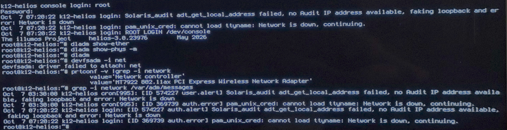

= Installing Helios

:TOC:
:toclevels: 1
:sectnums:
:icons: font
:source-highlighter: rouge  
xref:./README.md[Front Page Link]

== Intro
I'm installing Helios on my physical device and using the image and instructions from the https://github.com/oxidecomputer/helios-engvm#installing-on-a-physical-machine-using-the-iso[Oxide GitHub].  

Per the documentation I downloaded the `vga` image from the https://pkg.oxide.computer/install/latest/[pkg site].  

== Attempt 01

I put the image on a drive that I already had setup with https://www.ventoy.net/en/index.html[Ventoy] and was able to boot to the command prompt

[source,shell]
----
diskinfo

# Example: install-helios <hostname> <diskinfo number>
install-helios k12-helios c2t0C82D52507001812d0
----

This attempted to install but couldn't find the ISO.  

image::assets/ventoy_install_error.jpg[]  

== Attempt 02

I have an old 16G flash drive and wrote the ISO to it.  

From the macOS terminal I ran these commands to write the image to disk.  

[source,shell]
----
# Use this to get the device disk number
diskutil list 

  /dev/disk4 (external, physical):
     #:                       TYPE NAME                    SIZE       IDENTIFIER
     0:     FDisk_partition_scheme                        *16.1 GB    disk4

# unmount the drive so we can over write it
diskutil unmountDisk disk4 

# Write ISO to disk. There will be no output
sudo dd if=/Users/mlitsey/Downloads/helios-install-vga.iso of=/dev/disk4 bs=8m 

# use if the system doesn't automatically ask to eject the drive
diskutil eject disk4 
----

- This time the installation worked as expected.  

image::assets/helios_install_success.jpg[]  

== Networking

Following the guide for getting the system connected to the network, I ran the following commands.  

[source,shell]
----
dladm show-ether
dladm show-phys -m
----

Both commands came back without any output.  My hardware is using Realtek 2.5G nics, these don't appear to be part of the image.  I wouldn't expect them to be since they are consumer and not enterprise hardware.  

[source,shell]
----
# check to see if OS can see the devices
prtconf -v |grep -i network

# check the log for network messages
grep -i network /var/adm/messages
----

  

=== Add driver for NIC

Found this https://illumos.topicbox.com/groups/bugs/T2ca4088e26d7b6a2-M0c753e3d7d694026e5f1d9b6/illumos-gate-bug-13729-driver-issue-with-realtek-rtl8125[Work Around] that force enables the RTL8125 driver. 

[source,bash]
----
# edit this file
vim /etc/driver_aliases

# I went to the same location with the rest of the rge drivers
/^rge

# I then added these lines to the file
rge "pci10ec,8125"
rge "pciex10ec,8125"

# save and exit
esc
:wq

# reboot for changes to take place
reboot
----

At this point the `dladm show-ether` and `dladm show-phys -m` have both `rge0` and `rge1` listed with 0 being up at 1G-f speed.  

I continued with the setup from documentation.  

[source,bash]
----
ipadm create-if rge0
ipadm create-addr -T dhcp -h $(hostname) rge0/dhcp
----

This timed out and came back with an error that the system couldn't communicate with the dhcp server.  

I did some more searching and found that someone seems to have the driver working https://www.illumos.org/issues/18094?tab=history[here], but there are no instructions on how to make it work.  Looking further from the `Gerritt CR` link on that page I found this https://code.illumos.org/c/illumos-gate/+/4732[merge conflict] page.  

Another page recommened manually seeting a lower speed using the `ndd -set` command.  I didn't get that to work either.  

My final try at getting this to work was using `ifconfig` commands to use an ephemeral DHCP or static configuration.  Neither of these worked either.  

I have ordered a https://www.amazon.com/Ethernet-1000Mbps-Low-Profile-Industrial-Embedded/dp/B0GXXRTQPQ/ref=sr_1_3?crid=2YH83X2EH4L16&dib=eyJ2IjoiMSJ9.Y-XUYZcKG-EZ76IEnHOrUtJr9umTiv6pAu68jWz-OkRqRcecuTuVFjgKxm2h5tpDVaPpAYf8cpUPq_7bH4UgAICOdE_rbqPwTRUxwifXes-v1xAR6rMAa94LOK2QGYOx2JFB-cT-vnOz4gn4m91U7R2CubV4NRLGdnsz_17UXOnTBf19uLZ1w6_vwktZqwhpqhHqtBc8kldHQpTz-54FNNvPzD3d_5w2oC-Oz1ZZAFg.bVRDyqk_Ai7_n3WdrJwObBf6kdnvMc7bqONf1jfkxbI&dib_tag=se&keywords=M.2+B%2BM+Key+Gigabit+Ethernet+Network+Card%2C+Intel+I210+Chip&nsdOptOutParam=true&qid=1791427110&sprefix=m.2+b%2Bm+key+gigabit+ethernet+network+card%2C+intel+i210+chip+%2Caps%2C186&sr=8-3[M.2 intel card] that I will try next.  If that doesn't work I may move to using my Dell PowerEdge r730xd for testing.  

