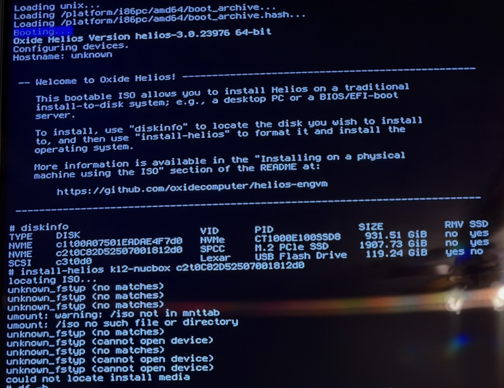
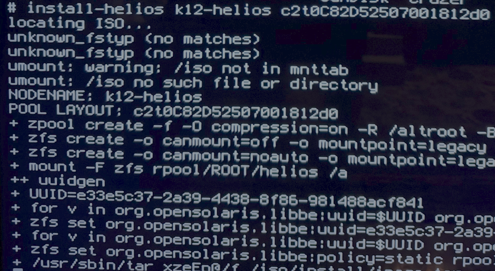

# Installing Helios

:TOC:
xref:./README.md[Front Page Link]

## Intro
I'm installing Helios on my physical device and using the image and instructions from the https://github.com/oxidecomputer/helios-engvm#installing-on-a-physical-machine-using-the-iso[Oxide GitHub].  

Per the documentation I downloaded the `vga` image from the https://pkg.oxide.computer/install/latest/[pkg site].  

## Attempt 01

I put the image on a drive that I already had setup with https://www.ventoy.net/en/index.html[Ventoy] and was able to boot to the command prompt

[source,shell]
----
diskinfo

# Example: install-helios <hostname> <diskinfo number>
install-helios k12-helios c2t0C82D52507001812d0
----

This attempted to install but couldn't find the ISO.  

  

## Attempt 02

I have an old 16G flash drive and wrote the ISO to it.  

From the macOS terminal I ran these commands to write the image to disk.  

[source,shell]
----
# Use this to get the device disk number
diskutil list 

  /dev/disk4 (external, physical):
     #:                       TYPE NAME                    SIZE       IDENTIFIER
     0:     FDisk_partition_scheme                        *16.1 GB    disk4

# unmount the drive so we can over write it
diskutil unmountDisk disk4 

# Write ISO to disk. There will be no output
sudo dd if=/Users/mlitsey/Downloads/helios-install-vga.iso of=/dev/disk4 bs=8m 

# use if the system doesn't automatically ask to eject the drive
diskutil eject disk4 
----

- This time the installation worked as expected.  

  
